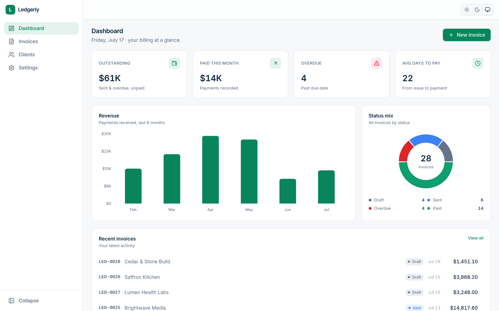
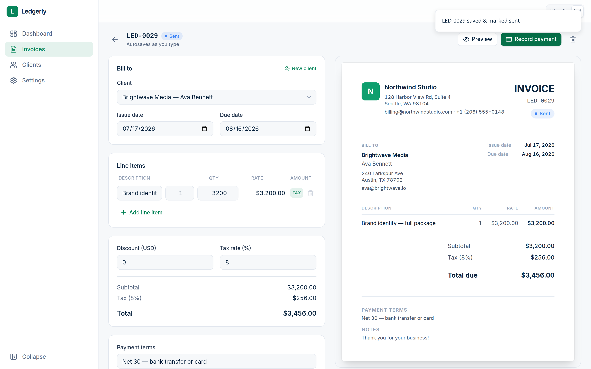
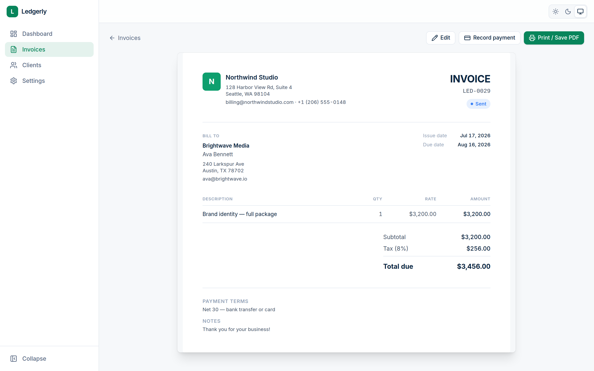
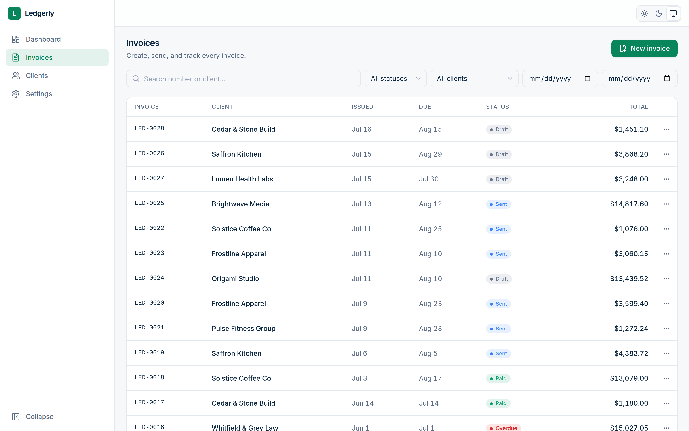
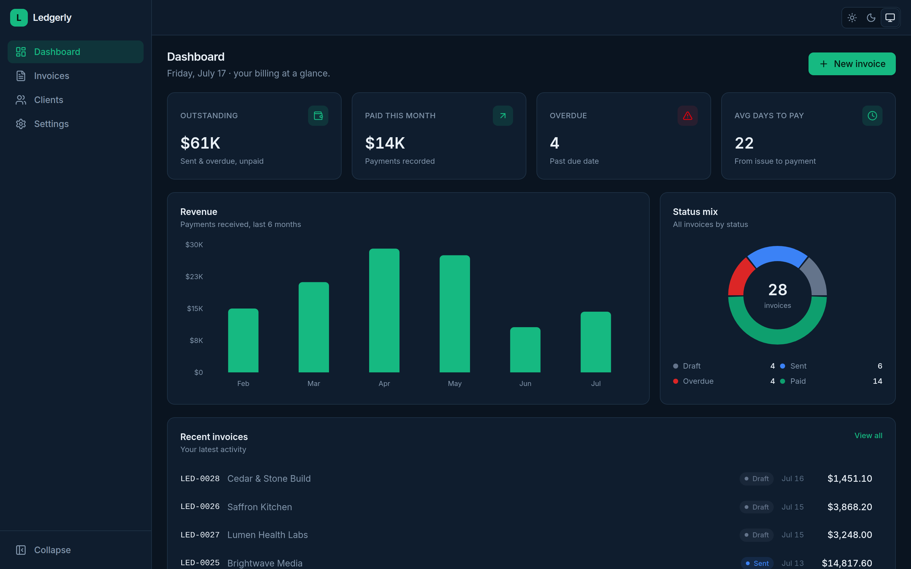

# Ledgerly — Invoicing & Billing

A crisp fintech invoicing tool in a deliberate "ledger green" identity. Build
invoices in a **live two-pane editor**, track outstanding / sent / overdue
balances at a glance, record payments, and print a genuinely professional PDF
straight from the browser — no backend.

**Live demo:** [ledgerly-psi-two.vercel.app](https://ledgerly-psi-two.vercel.app) · No sign-up wall — the app seeds
itself with 12 clients and 28 invoices (across every status and the last six
months) on first load, so it's alive within a second.



## Highlights

|  |  |
| --- | --- |
|  |  |
| **Two-pane editor (the signature)** — the invoice document on the right updates keystroke-by-keystroke as you edit on the left, and autosaves. | **Print-perfect document** — a dedicated print stylesheet turns the browser's "Save as PDF" into a clean A4 invoice with zero app chrome. |
|  |  |
| **Invoices** — filter by status / client / date range, search, colour-coded status pills, and per-row actions (mark sent, record payment, duplicate, delete). | **Light / dark / system** — persisted, respects your OS, no flash on load; the document always prints on white paper. |

## Features

- **Invoice editor** — client picker, issue/due dates, repeatable line items
  (description, qty, rate, per-line tax toggle), flat discount, live-calculated
  subtotal / tax / total, and auto-numbering (`LED-0043`) from settings. On `xl`
  screens it's a two-pane layout with a live document preview; below that, the
  form plus a **Preview & print** link.
- **Statuses** — `draft`, `sent`, `paid`, and `overdue` (computed automatically
  from the due date). Actions: mark sent, record payment, duplicate, delete —
  each with an optimistic update and a `sonner` toast.
- **Dashboard** — count-up stat cards (outstanding, paid this month, overdue
  count, average days to payment), a six-month revenue bar chart, a status
  donut, and a recent-invoices feed.
- **Clients** — a searchable list with per-client outstanding balances, and a
  detail page with their invoices and a billed / paid / outstanding rollup.
- **Settings** — business profile, logo upload (a small base64 data URL), invoice
  prefix + next number, default tax rate, and currency (drives all money
  formatting via `Intl.NumberFormat`, rendered in tabular numerals).
- **Polish everywhere** — loading skeletons (never spinners), designed empty
  states, `prefers-reduced-motion` respected, responsive to 375px, a custom 404,
  per-app favicon / title / OG image, and a one-click **Reset demo data**.
- **Signature motion** — dashboard numbers count up, charts animate in, line
  items add/remove with `AnimatePresence` height transitions, the status pill
  animates its colour when an invoice is paid, an autosave "Saved" tick fades in,
  the print preview opens with a gentle scale-fade, and a small confetti burst
  fires only when an **overdue** invoice finally gets paid.

## Architecture

The UI never touches `localStorage` directly. All data access goes through a
single **API-shaped storage layer** ([`src/lib/storage.ts`](src/lib/storage.ts)
→ [`src/lib/api.ts`](src/lib/api.ts)) that behaves exactly like an async API
client: every call returns a `Promise`, resolves after a simulated 200–500 ms of
latency (so loading skeletons and optimistic updates are real), reads/writes
versioned keys (`ledgerly.v1.*`), and falls back to an in-memory map when storage
is blocked (Safari private mode). Because the data layer is API-shaped, swapping
in a real backend — Laravel, Node, a ZATCA e-invoicing gateway — is a one-file
change; the pages don't move.

All invoice money math lives in one place
([`src/lib/invoice.ts`](src/lib/invoice.ts)): `computeTotals` distributes the
discount proportionally so tax is charged only on the discounted value of
taxable lines (the VAT-correct order), and `effectiveStatus` derives `overdue`
from a sent invoice's due date. A dev-only self-check asserts the math on every
`npm run dev`.

Routes are code-split (`React.lazy`) so Recharts stays out of the initial bundle
and only loads on the dashboard.

## Tech stack

Vite · React · TypeScript · Tailwind CSS v4 · Motion (`motion/react`) · Zustand ·
React Router · React Hook Form + Zod · Recharts · lucide-react · sonner ·
date-fns.

## Getting started

```bash
npm install
npm run dev        # http://localhost:5173
npm run build      # typecheck + production build to dist/
npm run preview    # serve the build
npm run lint       # oxlint
npm run seed       # regenerate the demo seed data
```

## Project layout

```
src/
  lib/         storage.ts (API-shaped layer), api.ts, invoice.ts (money math),
               constants.ts, utils.ts, date.ts
  store/       theme, ui (global client form + data-version tick)
  hooks/       useAsync, useCountUp, useCurrency
  components/  ui/ primitives, layout/ (shell), InvoiceDocument, ClientFormModal
  pages/       Dashboard, Invoices, InvoiceEditor, InvoicePreview,
               Clients, ClientDetail, Settings, NotFound
  seed/        JSON seed data loaded on first visit
scripts/       generate-seed.mjs (deterministic seed generator)
```

_Demo project — all data is local to your browser; **Reset demo data** in
Settings restores the seed._
